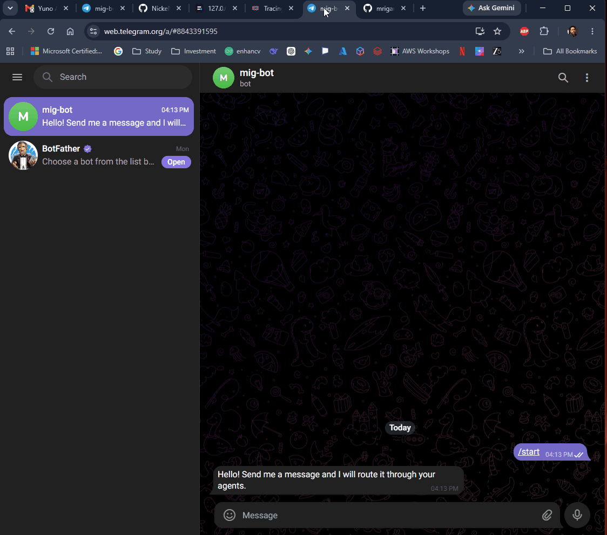
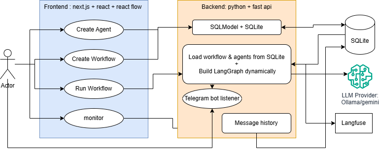

# AIAgentOrchestrationPlatform

## Working Requirement Coverage

- Agent CRUD is implemented through the web UI and REST API for name, role, system prompt, model, tools, channels, schedule, memory, skills, interaction rules, guardrails, and limits.
- Visual workflow builder is implemented with React Flow for connecting agents into LangGraph workflows.
- Workflow definitions are persisted in SQLite and dynamically executed by LangGraph from saved JSON.
- Agent configuration, workflow definitions, and message history are persisted with SQLModel and SQLite.
- Agent-to-agent execution works through shared workflow state, where each agent output is appended and passed to the next node.
- At least two workflow templates are seeded: Customer Support Triage and Research and Summary.
- External messaging channel is implemented with Telegram long polling.
- Live monitor shows workflow runs, user prompts, agent outputs, token estimates, cost estimates, and Langfuse links.
- Langfuse tracing records workflow-level traces and per-agent observations, tested with local, container based Langfuse.
- Local model execution is supported through Ollama, with optional Gemini, OpenAI, Anthropic, and mock fallback paths.
- Single-command local run is supported with `.\proto.ps1`.
- Single-container deployment path is supported with the included Dockerfile.
- Backend tests cover agent APIs, workflow execution, LangGraph building, tools, Telegram helpers, integrations, and WebSocket monitoring.

## Short-Demo


## Tech Stack

| Tech stack | What it does | Why | Tradeoff |
| --- | --- | --- | --- |
| LangChain | Provides message abstractions, model integrations, tools, and LLM invocation patterns used by each agent. | It gives a standard way to connect agents to different LLM providers and tools without hard-coding one model vendor. | It is not used as the workflow orchestrator because LangGraph gives clearer graph execution, node routing, and state transitions. |
| LangGraph | Dynamically builds and runs the multi-agent workflow graph from the saved workflow JSON. | The product needs agent-to-agent workflows with ordered steps, conditional edges, and feedback loops, which are naturally represented as a graph. | Chosen over CrewAI and AutoGen because this app needs user-authored visual graphs, not mostly conversation/team abstractions; chosen over a custom runtime to avoid rebuilding graph execution, routing, and state handling. |
| FastAPI | Exposes REST APIs for agents, workflows, integrations, execution, and monitoring. | It is async-friendly, lightweight, and works well with WebSockets, Telegram polling, and Python AI libraries. | Django would add more built-in structure than needed; Flask would require more manual async/WebSocket setup. |
| SQLModel | Defines typed database models for agents, workflows, and message history. | It combines Pydantic validation with SQLAlchemy persistence, keeping API schemas and database models easy to maintain. | Raw SQLAlchemy is more flexible but more verbose; using separate Pydantic and ORM models would duplicate schema logic for this prototype. |
| SQLite | Stores local data such as agent configuration, workflow definitions, and message history. | It keeps the project fully local and simple to run without requiring an external database service. | PostgreSQL would be better for production concurrency, but SQLite is simpler for a local single-container challenge demo. |
| Next.js | Provides the frontend application for managing agents, building workflows, and viewing monitor logs. | It gives a structured React app with build/export support, making the UI easy to run locally or serve from the backend. | Vite would be lighter, but Next.js gives a familiar app structure and static export path for deployment. |
| React | Powers the interactive UI components and state management on the frontend. | The platform needs a dynamic visual interface for CRUD forms, workflow editing, and live monitoring. | Server-rendered templates would be simpler, but they would make the visual workflow builder and live monitor less ergonomic. |
| React Flow / @xyflow/react | Renders the visual workflow builder with draggable nodes and edges. | It is purpose-built for graph editors, so users can visually connect agents instead of editing JSON manually. | Building a graph canvas manually would take longer and be less reliable for node/edge interactions. |
| WebSocket | Streams workflow and agent events to the monitor page in real time. | Monitoring should update live while a workflow runs, instead of waiting for the user to refresh history. | Polling would be simpler but less responsive and would create unnecessary repeated API requests. |
| asyncio broker | Publishes runtime events from the backend to WebSocket subscribers. | It keeps live event delivery lightweight and local without adding Redis, Kafka, or another message broker. | Redis pub/sub would scale better across multiple processes, but the requirement targets a local single-container app. |
| python-telegram-bot | Connects Telegram messages to the default workflow. | It satisfies the external messaging channel requirement and allows a human to interact with agents conversationally. | Slack or WhatsApp could also work, but Telegram long polling is simpler to run locally without public webhooks. |
| Langfuse | Records workflow traces and per-agent observations. | It makes execution visible outside the app, showing each agent step separately for debugging and observability. | Custom trace tables would be simpler locally, but Langfuse provides purpose-built LLM observability and trace visualization. |
| Ollama | Runs local models through an OpenAI-compatible HTTP API. | It lets the project work locally without depending on paid cloud model APIs. | Hosted models may be stronger, but Ollama keeps the demo private, local, and usable without API credits. |
| OpenAI / Anthropic / Gemini adapters | Provide optional hosted LLM backends when API keys are configured. | They make the runtime flexible so agents can use stronger hosted models when available. | Supporting multiple providers adds configuration complexity, but avoids locking the platform to one model vendor. |
| Uvicorn | Runs the FastAPI ASGI application during development and deployment. | It supports async APIs and WebSockets, which are core to workflow execution and live monitoring. | Gunicorn alone is not enough for ASGI/WebSockets; Uvicorn is the direct fit for this async app. |
| Docker | Packages backend, frontend build output, and runtime dependencies into one container. | It gives a repeatable single-container run path for demos and review. | Local scripts are faster while developing, but Docker is more predictable for evaluators. |
| TypeScript | Adds type checking to frontend components, hooks, and API data handling. | It reduces UI regressions when workflow, agent, and monitor payload shapes change. | Plain JavaScript would be quicker initially, but TypeScript catches payload and component mistakes earlier. |

For the required AI framework choice, this project uses **LangGraph**. The requirement allowed one of openclaw.ai, LangGraph, CrewAI, AutoGen, or a custom runtime; LangGraph was selected because the core product is a visual workflow builder where users connect agents as nodes and edges, then the backend dynamically executes that graph. CrewAI and AutoGen are strong for agent collaboration patterns, but they are less directly aligned with user-authored graph definitions. openclaw.ai is oriented toward always-on agents with SOUL.md/MEMORY, while this project focuses on run-based workflow execution. A custom runtime would satisfy the requirement, but it would add avoidable risk by reimplementing graph routing, state passing, and async node execution that LangGraph already provides.

## Architecture Flow



## Workflow JSON Flow

The frontend first creates reusable agents, then creates workflows visually with React Flow. The workflow JSON references saved agents by `agent_id`. The backend stores the agent configuration and workflow definition in SQLite, then uses the saved definition to dynamically build and execute a LangGraph workflow.

### 1. Create Agent

`POST /api/agents/`

```json
{
  "name": "Research Agent",
  "role": "Collects useful context and source material",
  "system_prompt": "You are the research agent. Gather facts, risks, and implementation notes. Do not write the final answer.",
  "model": "ollama:llama3.2:3b",
  "tools": ["search_kb"],
  "channels": ["api", "telegram"],
  "skills": ["research", "context gathering"],
  "interaction_rules": "Return structured notes only. Hand off to the summary agent for final wording.",
  "guardrails": "Do not invent facts. Say when information is uncertain.",
  "limits": {
    "max_turns": 4,
    "max_tokens": 800
  },
  "memory_type": "buffer",
  "schedule": null
}
```

Example second agent:

```json
{
  "name": "Summary Agent",
  "role": "Turns research notes into a final answer",
  "system_prompt": "You are the summary agent. Use the previous agent output and produce a concise final response.",
  "model": "ollama:llama3.2:3b",
  "tools": [],
  "channels": ["api", "telegram"],
  "skills": ["summarization", "executive communication"],
  "interaction_rules": "Do not redo the research. Summarize the previous agent output.",
  "guardrails": "Keep the answer grounded in the prior notes.",
  "limits": {
    "max_turns": 4,
    "max_tokens": 800
  },
  "memory_type": "buffer",
  "schedule": null
}
```

Each agent is saved in the `agent` table. The response contains the generated `id`, which is used as `agent_id` in the workflow JSON.

### 2. Save Workflow

`POST /api/workflows/`

```json
{
  "name": "Research and Summary Workflow",
  "description": "Researches a topic first, then summarizes the research output.",
  "is_template": false,
  "definition": {
    "triggers": [
      {
        "channel": "api",
        "reply": true
      },
      {
        "channel": "telegram",
        "reply": true
      }
    ],
    "entry_node": "research",
    "end_nodes": ["summary"],
    "nodes": [
      {
        "id": "research",
        "agent_id": "RESEARCH_AGENT_UUID"
      },
      {
        "id": "summary",
        "agent_id": "SUMMARY_AGENT_UUID"
      }
    ],
    "edges": [
      {
        "source": "research",
        "target": "summary",
        "condition": null,
        "condition_map": null
      }
    ]
  }
}
```

The workflow is saved in the `workflowdefinition` table. The `definition` field stores the dynamic graph structure: triggers, entry node, end nodes, agent nodes, and edges.

### 3. Execute Workflow

`POST /api/workflows/{workflow_id}/execute`

```json
{
  "user_message": "Compare Kubernetes and Azure Container Apps for hosting a small FastAPI service. Research first, then summarize for a startup CTO."
}
```

### 4. How the Backend Builds LangGraph Dynamically

At execution time, the backend does not use a hard-coded workflow. It reads the saved `definition` JSON and converts it into a LangGraph `StateGraph`.

The dynamic mapping is:

| Workflow JSON field | Backend behavior |
| --- | --- |
| `entry_node` | Sets the LangGraph starting node with `graph.set_entry_point(entry_node)`. |
| `nodes[].id` | Creates a LangGraph node with that node id. |
| `nodes[].agent_id` | Binds the graph node to the saved agent configuration in SQLite. |
| `edges[].source` and `edges[].target` | Adds graph transitions between agent nodes. |
| `edges[].condition` and `condition_map` | Adds conditional routing when an edge needs runtime decision logic. |
| `end_nodes[]` | Marks finish points with `graph.set_finish_point(node_id)`. |

Conceptually, this workflow definition:

```json
{
  "entry_node": "research",
  "end_nodes": ["summary"],
  "nodes": [
    {
      "id": "research",
      "agent_id": "RESEARCH_AGENT_UUID"
    },
    {
      "id": "summary",
      "agent_id": "SUMMARY_AGENT_UUID"
    }
  ],
  "edges": [
    {
      "source": "research",
      "target": "summary",
      "condition": null,
      "condition_map": null
    }
  ]
}
```

becomes this runtime graph:

```text
START
  -> research node
  -> summary node
  -> END
```

Each graph node is an agent runner. When LangGraph invokes a node, the backend loads the matching agent by `agent_id`, builds that agent's prompt, calls configured tools, calls the selected LLM through LangChain-compatible message objects, appends the agent output to workflow state, and passes that updated state to the next node.

### 5. Runtime Execution

When the workflow runs, the backend performs these steps:

- Loads the workflow definition from SQLite.
- Loads each referenced agent configuration from SQLite.
- Builds a LangGraph dynamically from `entry_node`, `nodes`, `edges`, `condition_map`, and `end_nodes`.
- Starts with the user message as the first message in workflow state.
- Runs the first agent node.
- Passes the updated message state to the next agent node.
- Stores the user prompt and each agent output in message history.
- Publishes live monitor events over WebSocket.
- Sends workflow and per-agent telemetry to Langfuse.
- Returns the final agent output to the frontend or Telegram.

### 6. Backend Response

```json
{
  "response": "For a small FastAPI service, Azure Container Apps is usually the faster choice...",
  "workflow_run_id": "82e04532-35e1-49a8-914e-8a2561fe3342",
  "token_count": 642,
  "cost_usd": 0
}
```

In short, the JSON flow is:

```text
Frontend create agent form
  -> agent JSON
  -> FastAPI
  -> SQLite agent table
Frontend visual workflow
  -> workflow JSON
  -> FastAPI
  -> SQLite workflowdefinition table
Workflow execution request
  -> load workflow + agents from SQLite
  -> dynamic LangGraph build
  -> agent execution
  -> message history in SQLite
  -> telemetry in Langfuse
  -> final response
```

## Run the App With One Command

The prototype is designed to run locally with one PowerShell command:

```powershell
.\proto.ps1
```

This command creates the backend virtual environment if needed, installs backend dependencies, installs frontend dependencies, builds the Next.js static frontend, copies it into `backend/static`, and starts FastAPI at:

```text
http://127.0.0.1:8000
```

### Configure `.env`

Before running the app for the first time, copy the example env file:

```powershell
Copy-Item .env.example backend\.env
```

Then update `backend\.env`.

Minimum local configuration:

```env
TELEGRAM_POLLING_ENABLED=false
OLLAMA_BASE_URL=http://localhost:11434
DATABASE_URL=sqlite+aiosqlite:///./app.db
LOG_LEVEL=INFO
```

For Gemini:

```env
GEMINI_API_KEY=your_gemini_api_key
```

For OpenAI:

```env
OPENAI_API_KEY=your_openai_api_key
```

For Anthropic:

```env
ANTHROPIC_API_KEY=your_anthropic_api_key
```

For Telegram:

```env
TELEGRAM_BOT_TOKEN=your_telegram_bot_token
TELEGRAM_POLLING_ENABLED=true
```

For Langfuse:

```env
LANGFUSE_PUBLIC_KEY=your_langfuse_public_key
LANGFUSE_SECRET_KEY=your_langfuse_secret_key
LANGFUSE_HOST=http://localhost:3003
```

Useful `proto.ps1` commands:

```powershell
.\proto.ps1                 # build and start the app
.\proto.ps1 -Action build   # install dependencies and build only
.\proto.ps1 -Action status  # show whether the app is running
.\proto.ps1 -Action stop    # stop the running app
```

### Docker

The Dockerfile also runs the frontend and backend as one app in one container.

Build:

```powershell
docker build -t ai-agent-orchestration-platform .
```

Run:

```powershell
docker run --rm -p 8000:8000 --env-file backend\.env -e OLLAMA_BASE_URL=http://host.docker.internal:11434 ai-agent-orchestration-platform
```

Open:

```text
http://127.0.0.1:8000
```
